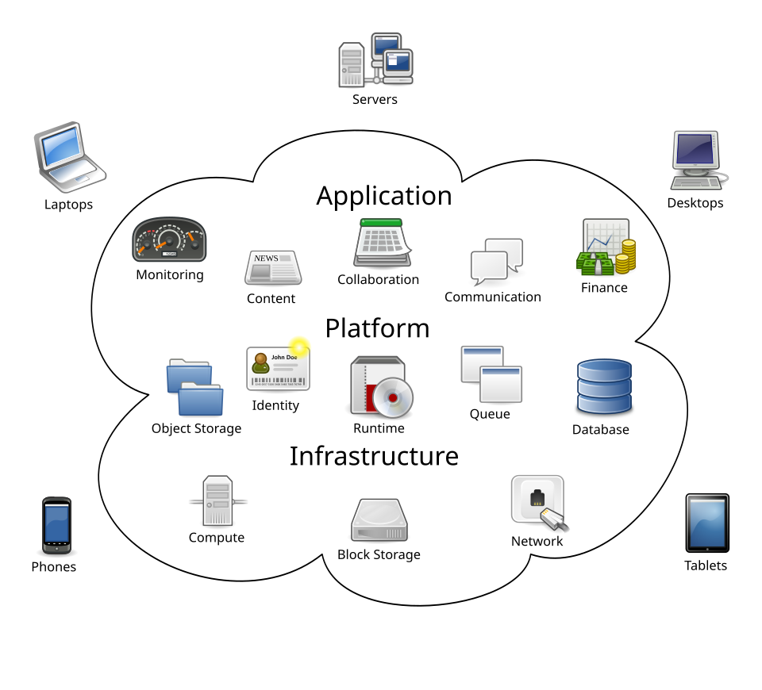
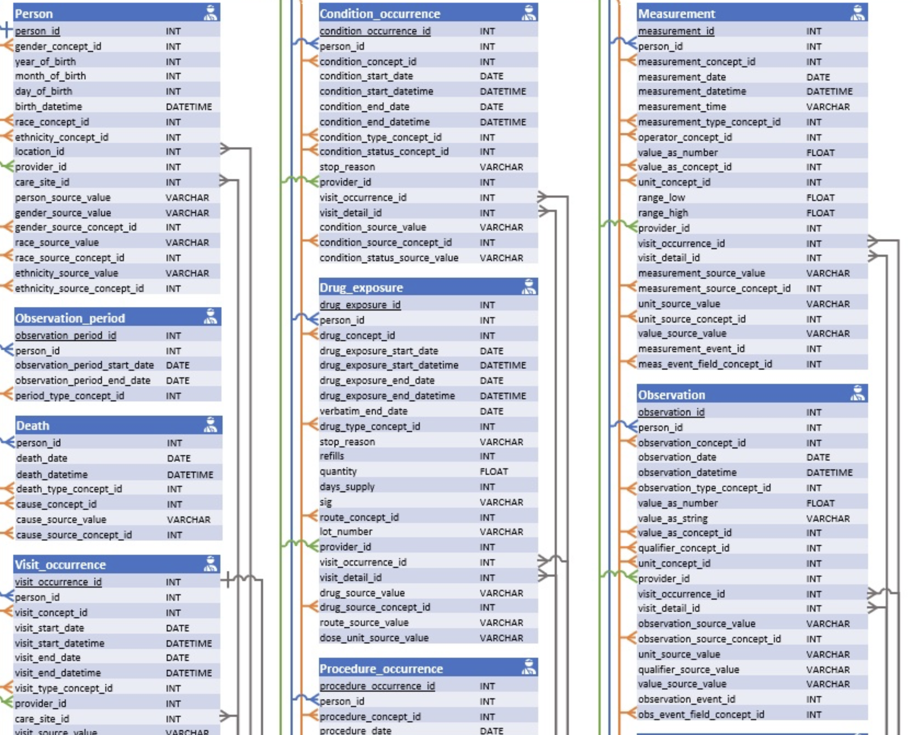

## Learning Objectives

In this session, we will start with an overview of cloud computing concepts. We will then log into the *All of Us* Workbench and build the cohort and datasets for your project.

At the end of Session 1, learners will be able to:

1. Define the concept of cloud computing and its advantages in working with large and sensitive data.
2. Identify and navigate the components of Researcher Workbench.
3. Demonstrate proper steps of starting and ending analysis sessions in the Workbench.
4. Demonstrate using the Workbench tools to create cohorts and datasets.

## What is Cloud Computing?

Cloud computing is the on-demand availability of computing resources (servers, storage, software, etc) over the internet. Common services include AWS by Amazon, Azure by Microsoft, and Google Cloud Platform (GCP). The *All of Us* Researcher Workbench is built on GCP. Cloud computing allows users to only pay for what they use without having to maintain the computing resources themselves.

"Cloud Computing" by Sam Johnston is licensed under 
  <a href="https://creativecommons.org/licenses/by-sa/3.0/">CC BY-SA 3.0</a>.

Cloud computing is especially advantageous for researchers to share and analyze large data as they do not have to buy and maintain expensive hardware. Cloud computing is also secure and provides better protection for sensitive data than if it were stored in individual researchers' own machines.

## Relational Database

*All of Us* data is organized in so-called "relational database." In a relational database, data is not stored in a single, massive spreadsheet, but rather organized into multiple, specialized tables that are linked together through shared identifiers called "keys." This structure ensures data integrity and efficiency.

(Full diagram at: <http://ohdsi.github.io/CommonDataModel/cdm54erd.html>)

Structured Query Language (SQL) is a programming language for interacting with relational databases. In *All of Us* context, point-and-click data extraction tools in the Workbench generates SQL queries automatically, which are then pasted to a notebook and run to extract data. Advanced users can write their own SQL queries themselves.

However, knowledge of SQL is not necessary to conduct research projects with *All of Us* and we will not learn it in this workshop. If you are interested, [*All of Us* Support Hub](https://support.researchallofus.org) has helpful articles and videos on how to use manual SQL queries to work with *All of Us* data.

## Navigating Researcher Workbench

Demonstration in class.

## Starting Analysis Environment

Demonstration in class.

## Workspace Bucket for Storage

There are two file storage options in *All of Us* Workbench: persistent disk and workspace bucket.

- The persistent disk is a storage space that automatically attaches to the virtual machine. From a user's standpoint, it acts similarly as a local drive on your computer which. makes it easy to save and retrieve files. However, it comes with an additional monthly cost in order to maintain the storage, and it cannot be shared with your workspace collaborators because it is unique to the individual user.

- The workspace bucket is a Google Cloud Storage system. Each project workspace you create comes with a workspace bucket that is permanently associated with the workspace. Files in the bucket are accessible to all collaborators in the same project workspace. Unlike the persistent disk, saving and retrieving files to and from the bucket require using specialized system commands (`gsutil`) rather than direct access.

In this workshop, we will use the workspace bucket exclusively. You will learn how to manage files in the bucket either using an R package or using `gsutil` system commands.

## Creating Cohorts and Datasets

Demonstration in class.

## Preparing for Next Session

In Session 2, we will learn basic R programming. We will use Posit Cloud, a cloud computing platform for R community. A free account will suffice for our purpose. Go to Posit Cloud: <https://posit.cloud> and click on `Log In`. Create a new account or log in with your Gmail account if you have one. Ensure you are able to log in prior to Session 2. 

While not strictly required, some familiarity will help. review this quick [R intro](https://yesols.github.io/projects/all-of-us/r/).

